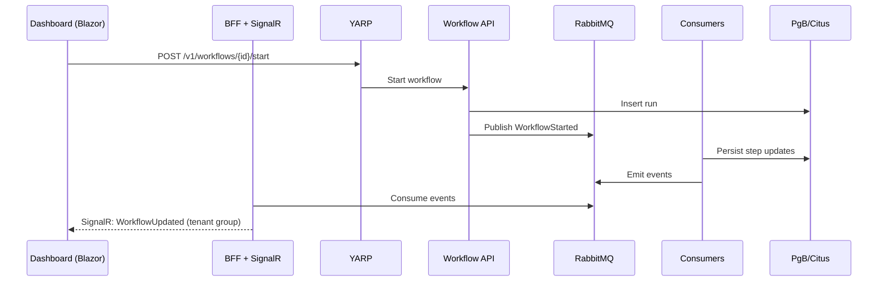

# Copilot instructions

These instructions align Copilot with Tansu.cloud’s architecture, coding standards, and long-term maintainability goals. Use them when proposing changes, generating code, writing docs, or reviewing PRs.

## Scope and intent
- Purpose: Generate production‑grade .NET code and documentation that fits Tansu.cloud’s architecture and conventions without hand‑holding.
- Audience: Contributors working across Gateway, Identity, Workflow, Storage, Vector, BFF/Dashboard, and Ops.
- Non‑goals: Experimental patterns, short‑lived hacks, or stack changes without an ADR.

## Architectural baselines
- Gateway: YARP (TLS, JWT validation, tenant routing, rate limits).
- Auth: OpenIddict + ASP.NET Core Identity (tenant‑aware OIDC).
- Workflows: MassTransit over RabbitMQ (sagas, retries, outbox).
- Realtime UX: SignalR hub in the Dashboard BFF (fan‑out of workflow/storage/vector events).
- Database: PostgreSQL with Citus (start single‑node; shard by tenant for scale).
- Connection pooling: PgBouncer (transaction pooling) in front of the Citus coordinator.
- Cache: Redis (sessions, idempotency keys, short‑lived artifacts).
- Vector: Qdrant (ANN) with metadata in Postgres.
- Storage: MinIO (S3‑compatible) as the object store. The .NET Storage service adds value with Brotli compression, image optimization (e.g., WebP/AVIF), and metadata enrichment on top of MinIO’s presigned URLs.
- Observability: Prometheus + Alertmanager + Grafana (golden signals), structured logging, OTEL metrics.

## Coding standards and patterns
- Language & style: .NET 8/9, nullable enabled, async/await everywhere, CA/IDE analyzers enabled, StyleCop (or EditorConfig) enforced.
- Project structure: Vertical slices by feature within each service; shared contracts live in a separate, versioned library.
- APIs: Minimal APIs or slim controllers, ProblemDetails for errors, versioned routes under `/v1`.
- DI and options: Constructor injection only, `IOptions<T>` for configuration (validate on start), avoid service locators.
- EF Core (Npgsql): Track only when necessary, migrations per service, no cross‑schema writes across services.
- Resilience: Polly for outbound HTTP, MassTransit retry policies, idempotency keys on commands.
- Cancellation: Always accept and pass `CancellationToken` from API to persistence and I/O.
- Immutability: Make DTOs records when appropriate; domain events are immutable.
- Comments: Adopt end‑of‑block comments (see “Commenting rules”).
- Testing: Unit (business rules), contract (HTTP/DTO), integration (DB/Bus), and smoke/load tests on hot paths.

## Communication protocol
Use this protocol in every interaction with a user request (issue, PR, chat, or code generation task).

### Understanding declaration
- What I understand: Summarize the user’s goal, constraints, and success criteria in 1–3 bullets before proposing changes.
- Context assumptions: Call out any assumptions (env, versions, dependencies) that affect the solution.

### Solution approach
- Files to add/modify: Enumerate the files and paths you’ll touch (e.g., `src/Workflow/Program.cs`, `libs/Contracts/...`).
- Technologies/patterns: Name the relevant frameworks and patterns (OpenIddict, MassTransit, YARP, EF Core, PgBouncer).
- Ordered steps: List the sequence of actions (schema changes → migrations → service endpoints → consumers → tests → dashboards).
- Risk notes: Highlight risks and mitigations (pool sizing, prepared statements, retries, idempotency).
- Exit criteria: Define what “done” looks like (tests pass, dashboards light up, docs updated).

## Querying Microsoft documentation
You have access to an MCP server called `microsoft.docs.mcp` that can search Microsoft’s latest official documentation.

- When to use: For specific, narrowly defined questions about C#, ASP.NET Core, Microsoft.Extensions, EF Core, Npgsql, the .NET SDK/runtime, or NuGet behaviors where precise, up‑to‑date details matter.
- How to use: Conduct a focused query, cite the relevant guidance in your reasoning (version‑specific if applicable), and incorporate the recommendation into the generated code or explanation.
- Priority: Prefer official docs from this source over memory for edge cases and new features.

## Database and pooling guidance
- Connection path: Every service uses Npgsql → PgBouncer (port 6432) → Citus coordinator → workers.
- PgBouncer mode: Transaction pooling. Disable prepared statements on the client.
- Recommended Npgsql options:

```text
Host=pgbouncer; Port=6432; Pooling=true; Maximum Pool Size=50; Multiplexing=true; No Reset On Close=true; Enlist=false; Auto Prepare Min Usages=0; Max Auto Prepare=0
```

- Sharding posture: Start single‑node; ensure all multi‑tenant tables include `tenant_id` for future distribution.
- Migrations: One migrations assembly per service schema; never couple cross‑service migrations.

## Messaging and realtime pattern
- Command path: HTTP → service → publish command/event (MassTransit/RabbitMQ) → consumer → Postgres via EF Core.
- UI updates: Dashboard BFF consumes events and broadcasts via SignalR groups keyed by tenant and resource IDs.
- Outbox: Use outbox for reliable publish in services that initiate events after DB writes.
- Backpressure: Batch event fan‑out to SignalR, coalesce frequent updates, and cap message size.

## Observability and operations
- Metrics: Expose `/metrics` (Prometheus). Track request rate, duration, error rate, DB pool saturation, queue depth, consumer lag.
- Tracing (optional): If OTEL traces are enabled, propagate correlation IDs across HTTP and bus.
- Dashboards: Provide Grafana boards for API latency, Postgres/Citus waits, PgBouncer pools, RabbitMQ queues, workflow KPIs.
- Alerts: SLO‑driven alerts (availability, P95/P99 latency, DLQ depth, error rates).

## Security and tenancy
- OIDC: OpenIddict with Authorization Code + PKCE for browser clients; Client Credentials for service‑to‑service.
- JWT at gateway: Validate and inject `X-Tenant-Id` header after resolving tenant (subdomain/header).
- RBAC: Role checks at BFF and service; avoid UI‑only enforcement.
- Secrets: Use environment variables or secret stores; never hard‑code secrets or keys.

## Commenting rules
Adopt end‑of‑block comments to make long‑lived maintenance friendlier and code folding clearer.

- Classes: `} // End of Class ClassName`
- Methods: `} // End of Method MethodName`
- Constructors: `} // End of Constructor ClassName`
- Properties: `} // End of Property PropertyName`

Example:

```csharp
public sealed class StorageController : ControllerBase
{
    private readonly IStorageService _service;

    public StorageController(IStorageService service)
        => _service = service; // End of Constructor StorageController

    [HttpPost("sign")]
    public async Task<ActionResult<SignedUrlResponse>> SignAsync([FromBody] SignRequest request, CancellationToken ct)
    {
        var url = await _service.CreateSignedUrlAsync(request, ct);
        return Ok(new SignedUrlResponse(url)); // End of Method SignAsync
    }

    public IStorageService Service => _service; // End of Property Service
} // End of Class StorageController
```

## Code generation checklist
- Understanding declaration: Summarize requirements and constraints first.
- Solution approach: List files, patterns, and steps.
- Program.cs: Top‑level hosting with minimal APIs; `builder.Services` for DI; `AddOptions<T>().Bind().ValidateOnStart()`; `MapGroup("/v1/...")`.
- EF Core setup: Use Npgsql with PgBouncer‑safe options (no auto‑prepare); `UseQuerySplittingBehavior` where needed; `AsNoTracking` for reads.
- MassTransit: Configure RabbitMQ host, durable endpoints, retry policies, and outbox (where DB writes occur).
- SignalR hub: Tenant‑scoped groups, backpressure handling, auth policies.
- Validation: FluentValidation or data annotations; return ProblemDetails on failure.
- Logging: Structured logs with correlation IDs; no `Console.WriteLine`.
- Tests: Arrange/Act/Assert with builders; integration tests spin ephemeral containers or use compose network.
- Docs: Update module README and public API docs; add Mermaid diagrams if flows changed.

### Typical service skeleton
```csharp
// Program.cs
var builder = WebApplication.CreateBuilder(args);

builder.Services.AddOptions<DbOptions>()
    .Bind(builder.Configuration.GetSection("Database"))
    .ValidateDataAnnotations()
    .ValidateOnStart();

builder.Services.AddDbContext<AppDbContext>((sp, opts) =>
{
    var cfg = sp.GetRequiredService<IOptions<DbOptions>>().Value;
    opts.UseNpgsql(cfg.ConnectionString, npgsql =>
    {
        npgsql.EnableRetryOnFailure();
    });
    opts.EnableSensitiveDataLogging(false);
    opts.UseQueryTrackingBehavior(QueryTrackingBehavior.NoTracking);
}); // End of AddDbContext

builder.Services.AddMassTransit(mt =>
{
    mt.SetKebabCaseEndpointNameFormatter();
    mt.UsingRabbitMq((context, cfg) =>
    {
        cfg.Host(builder.Configuration["RabbitMq:Host"], h =>
        {
            h.Username(builder.Configuration["RabbitMq:User"]);
            h.Password(builder.Configuration["RabbitMq:Password"]);
        });
        cfg.ConfigureEndpoints(context);
    });
}); // End of AddMassTransit

builder.Services.AddProblemDetails();
builder.Services.AddEndpointsApiExplorer();
builder.Services.AddHealthChecks(); // add Npgsql/RabbitMQ checks

var app = builder.Build();

app.UseExceptionHandler();
app.UseStatusCodePages();
app.MapHealthChecks("/health");
app.MapGet("/v1/health", () => Results.Ok(new { ok = true })); // End of health endpoint

app.Run(); // End of Method Main
// End of Program.cs
```

### Connection string (PgBouncer‑safe)
```text
Host=pgbouncer;Port=6432;Database=tansu;Username=app_user;Password=***;
Pooling=true;Maximum Pool Size=50;Tcp Keepalive=true;No Reset On Close=true;
Multiplexing=true;Enlist=false;Auto Prepare Min Usages=0;Max Auto Prepare=0
```

## Live diagrams

### Architecture overview
```mermaid
flowchart TB
  subgraph Client["Clients & SDKs"]
    SDK[NuGet SDKs]
    Dashboard[Blazor Admin]
  end
  Gateway[YARP Gateway]
  SDK --> Gateway
  Dashboard --> Gateway

  subgraph Services["Domain Services"]
    Identity[Identity (OpenIddict)]
    Workflow[Workflow (MassTransit)]
    Storage[Storage (.NET)]
    Vector[Vector API]
    BFF[Dashboard BFF + SignalR]
  end

  Gateway --> Identity
  Gateway --> Workflow
  Gateway --> Storage
  Gateway --> Vector
  Gateway --> BFF

  subgraph Infra["Infra & Data"]
    PgB[PgBouncer]
    Citus[(PostgreSQL + Citus)]
    Redis[(Redis)]
    RMQ[(RabbitMQ)]
    Qdrant[(Qdrant)]
    MinIO[(MinIO S3-compatible)]
    Prom[Prometheus]
    Graf[Grafana]
  end

  Services --> PgB --> Citus
  Workflow <---> RMQ
  Storage --> MinIO
  Vector --> Qdrant
  Workflow --> Redis
  Prom --> Gateway
  Prom --> Services
  Prom --> RMQ
  Graf --> Prom
```

### Workflow to realtime UI


## PR quality bar
- Understanding declaration: Present at the top of the PR description.
- Solution approach: Files, patterns, steps, risks, and exit criteria listed.
- Docs: Updated READMEs and diagrams for changed flows.
- Tests: Unit + integration for new endpoints/consumers; CI green.
- Security/ops: Health checks, metrics, and RBAC rules in place; no secrets in code.

## When to push back
- Scope creep: If a change violates baselines (e.g., swaps RabbitMQ for another broker) without an ADR.
- Maintainability risk: If code introduces strong coupling, global state, or bypasses DI/options.
- Performance risk: If EF queries ignore tenant sharding keys or bypass PgBouncer constraints.

By following this guide, Copilot will produce code and docs that fit Tansu.cloud’s architecture, scale safely, and remain maintainable for years.