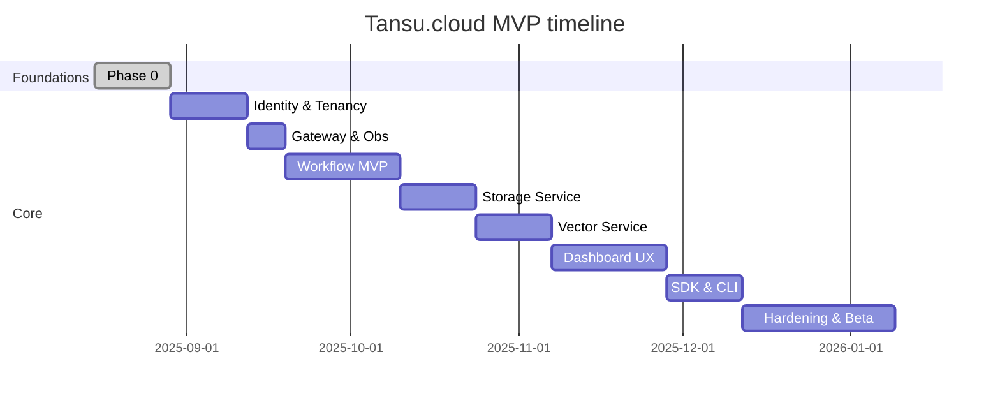

---

## docs/implementation-plan.md

# Tansu.cloud — Development and implementation plan

This plan prioritizes foundations, security, and observability, then delivers core value fast. Each phase includes objectives, scope, tasks, deliverables, acceptance, risks, and exit criteria. A Gantt‑style overview sits at the end.

---

## Phase 0 — Foundations and repo

- **Objectives:** Monorepo, build/test/compose, baseline observability, coding standards.
- **Scope:**
  - Repo structure (apps/, libs/, docs/, service configs under each infra service folder), solution files, analyzers.
  - All projects/services under the TansuCloud solution are containerized with Dockerfiles (multi‑stage builds) in their project folders. — Completed
  - Container orchestrator: Docker Compose (Visual Studio Docker Compose project at repo root). — Completed (docker-compose.yml + docker-compose.dcproj)
  - Dev/Prod Docker Compose with: Citus (single node), Redis, RabbitMQ, Qdrant, Prometheus, Grafana. — Completed (services defined in docker-compose.yml)
    - Note: Services connect directly to Postgres in early phases; a connection pooler will be added later.
  - .NET metrics exposed at `/metrics` via prometheus-net in Phase 0 (migrate to OpenTelemetry + Collector in Phase 2). — Completed (Gateway + Identity expose /metrics)
  - Runtime baseline: prefer chiseled images for production (no shell, non‑root). Alpine acceptable for dev. — Completed (chiseled images used)
- **Tasks:**
  - **Build:** GitHub Actions (build, test, lint, Docker).
  - **Compose:** Use the existing VS Docker Compose project (docker-compose.dcproj) as the anchor. Use root `docker-compose.yml` + override; add Prometheus and Grafana services and provisioning. — Completed
  - **Containerization:** Add multi‑stage Dockerfiles for every project/service (build → publish → minimal runtime). Use chiseled runtime images. Include OCI image labels (title, description, source, revision). Add `.dockerignore` to reduce context. — Completed
  - **Metrics:** Wire `/metrics` in Gateway using prometheus-net; add Prometheus scrape job for Gateway. — Completed (prometheus/prometheus.yml)
  - **DB bootstrap:** Provide init SQL to create database/roles; standardize DB name and credentials. — Completed (db/init/00-init.sql)
  - **Secrets:** Use `.env` files for dev/prod; provide `.env.example`; ignore `.env*` in VCS. — Completed (.env.example, .gitignore updated)
  - **Docs:** Onboarding + arch diagrams; runbooks skeleton (pool sizing, metrics, compose). — In progress (Onboarding present)
- **Deliverables:**
  - Root `docker-compose.yml` (gateway+prometheus+grafana) and `docker-compose.override.yml` (ports, env) next to `docker-compose.dcproj`. — Completed
  - Optimized multi‑stage Dockerfiles for each service using chiseled runtime and OCI labels. — Completed
  - `prometheus/prometheus.yml` (scrape gateway, identity, etc. as they are added). — Completed
  - Grafana provisioning under `grafana/provisioning/{datasources,dashboards}/` and dashboard `grafana/dashboards/gateway-overview.json`. — Completed
  - `db/init/00-init.sql` (CREATE DATABASE tansucloud; roles app_user; grants). — Completed
  - `.env.example` and `.gitignore` updated to ignore `.env*`. — Completed
- **Acceptance:**
  - `docker compose build` builds service images; `docker compose up -d` →
    - Services expose `/health` and `/metrics`. — Completed (Gateway, Identity)
    - Prometheus targets are UP and scraping. — Completed
    - Grafana reachable at :3000 with Prometheus datasource and Gateway Overview dashboard present. — Completed
  - No hard‑coded secrets in Compose or `.env`. — Completed
- **Risks/Mitigations:** Version drift → pin tags; healthchecks → use external HTTP checks with chiseled; image bloat → multi‑stage + `.dockerignore`.
- **Exit criteria:** Above acceptance verified; docs updated. — Completed

---

## Phase 1 — Identity and tenancy

- **Objectives:** Secure auth, tenant context end‑to‑end. — Completed
- **Scope:** OpenIddict + ASP.NET Identity, tenant resolver (subdomain/header), RBAC (Admin/Dev/Visitor). — Completed
- **Tasks:**
  - Token issuance (Authorization Code + PKCE, Client Credentials, Refresh). — Completed
  - Gateway JWT validation; `X-Tenant-Id` propagation and enforcement. — Completed
  - EF Core models (auth schema) with indices. — Completed (Identity + OpenIddict EF; EnsureCreated for dev)
  - Dashboard login UX using OIDC (server prerequisites ready; UI implemented in Phase 6). — Planned
- **Deliverables:**
  - OIDC endpoints for Dashboard login; `/auth/me` and `/tenants` endpoints. — Completed
  - test.http to exercise discovery, token, RBAC, and tenant propagation. — Completed
- **Acceptance:** E2E login using Auth Code + PKCE works against Identity; tenant enforced on protected routes; JWT includes `tenant_id`. — Met
- **Near‑term priorities (Phase 1 hardening):**
  - Enable refresh token rotation with reuse detection; configure sliding expiration with an absolute max session lifetime.
  - Tighten Gateway JWT validation for non‑dev (ValidateAudience=true; known audiences per service); RequireHttpsMetadata=true outside dev.
  - Disable password grant in prod; persist signing keys/certificates; expose JWKS; add logout; set secure cookie/SameSite.
  - Scope/role policies per route; least‑privilege for client_credentials; revoke authorization on refresh reuse.
  - Config snippets (Identity/Gateway):

    Identity (OpenIddict server) — refresh lifetimes + rotation

    ```csharp
    builder.Services.AddOpenIddict()
        .AddServer(options =>
        {
            options.AllowAuthorizationCodeFlow().RequireProofKeyForCodeExchange();
            options.AllowRefreshTokenFlow();
            options.RegisterScopes(OpenIddictConstants.Scopes.OfflineAccess);

            // Token lifetimes
            options.SetAccessTokenLifetime(TimeSpan.FromMinutes(15));
            options.SetRefreshTokenLifetime(TimeSpan.FromDays(30));

            // Refresh token rotation + reuse detection
            options.UseRollingTokens();                  // issue a new refresh token on each refresh
            // Sliding expiration is enabled by default; to force absolute expiration only:
            // options.DisableSlidingRefreshTokenExpiration();

            // ... signing credentials, endpoints, etc.
        });
    ```

    Gateway (JWT audience validation — prod)

    ```csharp
    builder.Services
        .AddAuthentication(JwtBearerDefaults.AuthenticationScheme)
        .AddJwtBearer(options =>
        {
            options.Authority = builder.Configuration["Identity:Authority"]!;
            options.RequireHttpsMetadata = true; // prod
            options.TokenValidationParameters = new TokenValidationParameters
            {
                ValidateAudience = true,
                ValidAudiences = new[]
                {
                    "tansucloud.gateway", // gateway audience
                    "tansucloud.bff"      // if BFF calls are validated here
                },
                NameClaimType = ClaimTypes.Name,
                RoleClaimType = ClaimTypes.Role
            };
        });
    ```

- **Operational notes:**
  - Rotate secrets; separate credentials per environment.
  - Scope/role least‑privilege per app; map apps to specific tenant(s).
  - For client_credentials tokens, enforce audience and X‑Tenant‑Id at Gateway (already implemented).

- **Backend work to add:**
  - Identity endpoints for invite creation/acceptance and registration, plus email delivery.
  - Dashboard pages for app registration, user invites, role assignment.
  - Optional per‑tenant external IdP configuration.

- **Notes:** Tenant enforcement added in Gateway middleware; Dashboard UX login flows will be built in Phase 6 using these OIDC capabilities.

---

## Phase 2 — Gateway, BFF, and observability

- **Objectives:** Single entrypoint; aggregated UI backend; metrics visible; alerting and tracing foundation. — In progress
- **Scope:** YARP routes; BFF endpoints (`/me`, `/tenants/current`, activity feed); Prometheus exporters wired; Alertmanager and basic SLO alerts; prepare for cross‑service tracking with OpenTelemetry Collector. — In progress (YARP + metrics wired)
- **Tasks (detailed):**
  - Correlation and logging
    - Add correlation ID middleware (prefer W3C traceparent; fall back to X-Correlation-ID)
    - Enrich logs with correlation/tenant/user/route; add request/response logging with size caps and redaction
    - Propagate correlation headers through Gateway to services (YARP transform)
  - Rate limiting
    - Configure ASP.NET Core rate limiting middleware with token-bucket policies
    - Policies by route group (auth vs BFF) and by identity (client_id/subject/tenant)
    - Expose metrics (rejections, queue length); add alerts on high reject rate
  - Alerting
    - Add Alertmanager service in compose; mount alert rules file
    - Author SLO alert rules: availability, P95/P99 latency, HTTP 5xx rate, DLQ depth baseline
    - Wire notification receivers (dev: webhook/log)
  - Tracing/metrics pipeline
    - Add OpenTelemetry Collector to compose (receivers: otlp, prometheus; exporters: prometheus, debug)
    - Migrate services from prometheus-net (as needed) to OTEL metrics; ensure propagation headers
    - Verify exemplars and labels are consistent (service, route, tenant)
  - Database pooler
    - Evaluate PgBouncer drop‑in replacements (e.g., Odyssey, PgCat) vs PgBouncer; select and integrate
    - Introduce the selected pooler with transaction pooling; update DSNs; set Npgsql Max Auto Prepare=0; tune pool sizes
    - Dashboards for pool utilization and Postgres wait events; update runbooks accordingly
  - Dashboards
    - Add API dashboards (latency histogram, error rate, request rate), DB dashboards (pool use, waits), RMQ dashboard
    - Provision Grafana alert panels for SLOs
- **Deliverables:** BFF + SignalR shell; baseline dashboards; Alertmanager + alerting config; OTEL Collector config; DB pooler (PgBouncer or drop‑in) and dashboards.
- **Acceptance:** Dashboards show P50/95/99 latency, error rates; SignalR handshake succeeds through Gateway; alert rules load without errors; pooler targets are UP and utilized. — Pending

---

## Phase 3 — Workflow engine MVP

- **Objectives:** Durable, observable workflows.
- **Scope:** MassTransit over RabbitMQ; saga state in Postgres; outbox; idempotency; realtime UI via BFF/SignalR.
- **Tasks (detailed):**
  - Contracts and schema
    - Define commands (StartWorkflow, CancelWorkflow) and events (WorkflowStarted, StepCompleted, Failed, Completed)
    - Model Postgres schema: workflows.definitions, runs, run_steps, run_logs (tenant_id indexed)
    - Add EF Core migrations; seed a sample workflow
  - API and orchestration
    - Endpoints: POST /v1/workflows/{id}/start, POST /v1/workflows/{id}/cancel, GET /v1/runs/{runId}, GET /v1/runs/{runId}/logs
    - Implement orchestrator service; generate run IDs; write initial state; publish commands/events
    - Idempotency keys on Start to avoid duplicate runs
  - Messaging and reliability
    - Configure MassTransit/RabbitMQ with retry (exponential), dead-letter; enable outbox where DB writes precede publish
    - Define consumers to progress steps and write run_steps/run_logs
    - Metrics: consumer lag, DLQ depth, processing duration
  - BFF realtime
    - BFF subscribes to workflow events; maps to tenant SignalR groups; emits compact updates
    - Coalesce frequent updates; throttle to avoid UI spam
  - Testing and ops
    - Integration tests for start/cancel; contract tests for endpoints and messages
    - Grafana dashboard: runs started/completed/failed, step duration, DLQ depth
- **Deliverables:**
  - Workflow API with endpoints and consumers; EF migrations; outbox configured
  - BFF event fan‑out via SignalR; dashboards for workflow KPIs
- **Acceptance:**
  - Sample workflow runs to completion; DLQ remains empty under nominal load
  - UI reflects updates within 1s; idempotent start enforced; retries cap failures
- **Risks/Mitigations:** Event storms → batch/coalesce; long‑running steps → heartbeats/timeouts; exactly‑once semantics → idempotency keys and outbox.

---

## Phase 4 — Storage service

- **Objectives:** Efficient, safe, scalable storage with optimization.
- **Scope:** Presigned URLs via MinIO, Brotli/WebP processing, metadata indexing, events.
- **Tasks (detailed):**
  - Infra and bootstrap
    - Add MinIO to compose; create buckets per tenant (prefix strategy); define policies
    - Healthcheck and metrics exporters; dashboard panels for capacity/requests
  - API surface
    - POST /v1/storage/presign (upload/download) with constraints (content-type, max size, checksum)
    - GET /v1/storage/objects (list), GET /v1/storage/objects/{id} (metadata)
    - Access control by tenant; short TTL; one‑time tokens (optional)
  - Metadata/indexing
    - Persist object records with tenant_id, sizes, checksum, content-type, status (Pending/Ready)
    - Extract EXIF and basic image metadata when applicable
  - Optimization pipeline
    - Background processor consumes ObjectUploaded → compress (Brotli) and image transforms (WebP/AVIF) where applicable
    - Streaming/pipe processing to avoid large memory spikes; resumable uploads (future)
    - Emit ObjectReady after processing; update metadata
  - Reliability and security
    - Idempotent processing; checksum verification; server-side encryption (SSE-S3) optional
    - Metrics: processing duration, failure rate; alerts on backlog age
  - Testing
    - Large file upload scenarios (1–5 GB) with streaming; contract tests for presign
- **Deliverables:**
  - Storage API with presign/list/metadata; background optimizer; events ObjectUploaded/ObjectReady
  - Dashboards for throughput, failure rate, capacity; sample upload flow in Dashboard
- **Acceptance:**
  - Large uploads succeed; optimizations recorded; access controls enforced by tenant
  - Metrics visible; backlog remains within target; processing failures alert
- **Risks/Mitigations:** Large file memory use → stream/pipe; signed URL misuse → short TTLs and constraints; capacity pressure → document scaling options.

---

## Phase 5 — Vector service

- **Objectives:** Useful semantic search with predictable performance.
- **Scope:** Collections management, embeddings upsert, top‑K search with filters; Qdrant integration; metadata in Postgres.
- **Tasks (detailed):**
  - Infra and schema
    - Add Qdrant to compose; configure snapshotting; health/metrics panels
    - Postgres meta tables: vector.collections, documents (tenant_id indexed)
  - API surface
    - POST /v1/vector/collections (create/list)
    - POST /v1/vector/documents: upsert (idempotent by external_id), batch support
    - POST /v1/vector/search: top‑K with filters; optional score threshold; return minimal payload and IDs
  - Embeddings and hybrid options
    - Accept embeddings from client; optional server‑side hook for rerank (pluggable, can be disabled)
    - Keep payload minimal; hydrate details from Storage/DB as needed
  - Reliability and ops
    - Idempotency keys on upsert; retries; backpressure on large batches
    - Metrics: P50/95 latency, QPS, memory, request errors; alerts on latency budget breaches
  - Testing
    - Deterministic test collections; golden queries; latency budget tests
- **Deliverables:**
  - Vector API with collections/upsert/search; Postgres meta; Qdrant wired
  - Dashboards for query latency and load; sample UI console
- **Acceptance:**
  - P95 query latency within target under baseline load; consistent results across runs
  - Idempotent upserts; filters work as specified; dashboards reflect load and latency
- **Risks/Mitigations:** Payload bloat → minimal payload return; noisy rerank → opt‑in with safeguards; performance drift → capacity guidance and monitoring.

---

## Phase 6 — Dashboard UX

- **Objectives:** Cohesive, role‑aware, tenant‑aware Dashboard that consolidates Users, Workflows, Storage, Vector, and Reports with realtime updates.
- **Scope:** MudBlazor UI shell, OIDC auth, tenant switcher, role‑based navigation, SignalR realtime, lists/detail views, reports/graphs, accessibility and performance budgets.
- **Tasks:**
  - Shell and navigation
    - [x] App shell with top bar, side nav, breadcrumbs, and responsive layout (MudLayout)
    - [x] Role‑based navigation filtering (Admin/Dev/Viewer) and feature flags
    - [x] Tenant switcher component (shows current tenant; switches context and persists selection)
    - [ ] Global search placeholder and command palette (optional)
  - Authentication and authorization
    - [ ] OIDC Authorization Code + PKCE sign‑in flow wired to Identity
    - [ ] Auth guard for protected routes; token refresh; sign‑out
    - [ ] RBAC on UI actions (buttons/menus) and route groups
  - Realtime and notifications
    - [ ] SignalR connection manager with auto‑reconnect and backoff
    - [ ] Toaster/notification service for workflow/storage/vector events
    - [ ] Tenant‑scoped SignalR groups and connection rejoin on tenant change
  - Modules and pages
    - Users: [ ] List/search/sort; [ ] View/edit user; [ ] Roles assignment; [ ] Invite/reset flows
    - Workflows: [ ] Definitions list; [ ] Run list with status; [ ] Run detail timeline; [ ] Live logs via SignalR
    - Storage: [ ] Bucket/object browser; [ ] Presign upload; [ ] Object detail with metadata/optimizations
    - Vector: [ ] Collections list; [ ] Upsert tester; [ ] Top‑K search with filters; [ ] Rerank preview (optional)
    - Reports: [ ] Traffic/latency/error rates; [ ] Workflow KPIs; [ ] Storage usage; [ ] Vector load (Grafana panels or embedded charts)
  - UX quality and resilience
    - [ ] Empty states, loading skeletons, and retry affordances on all lists
    - [ ] Error boundaries and ProblemDetails rendering
    - [ ] Keyboard navigation, focus order, and ARIA labels (WCAG 2.1 AA targets)
    - [ ] Dark mode and theme tokens (light/dark)
    - [ ] Virtualized tables for large lists; pagination and filter memory
  - Performance and ops
    - [ ] Lighthouse budgets: TTI < 3.5s on cold start; main thread < 2.0s; bundle size budgets
    - [ ] Cache API responses where safe; debounce search; lazy‑load heavy modules
    - [ ] Telemetry: UI perf beacons; log client errors with correlation ID
  - Testing
    - [ ] bUnit unit tests for components
    - [ ] Playwright E2E: login, tenant switch, create workflow run, observe realtime updates, upload object
- **Deliverables:**
  - Navigable Dashboard with modules: Users, Workflows, Storage, Vector, Reports
  - OIDC login/logout; tenant selector; role‑based menus
  - Live updates via SignalR; toasts for key events
  - Reports with latency/error/KPI charts; empty states and skeletons
  - Themes (light/dark), a11y support, and automated tests (bUnit + Playwright)
- **Acceptance:**
  - Core tasks in Users/Workflows/Storage/Vector completed within the Dashboard without leaving it
  - Lighthouse perf budget passes on dev hardware; a11y checks pass (axe/Pa11y)
  - Realtime updates are visible within 1s of server event under nominal load
  - RBAC enforced (menus/actions hidden/disabled per role) and tenant switch updates data correctly
- **Risks/Mitigations:**
  - Scope creep → Feature flags per module and progressive rollout
  - Realtime noise → Coalesce updates, rate‑limit toasts, and use incremental rendering
  - State complexity → Keep state local per module; use cascading context for auth/tenant; avoid global mutable singletons

---

## Phase 7 — SDKs and CLI

- **Objectives:** First‑class developer experience.
- **Scope:** NuGet SDKs (Auth/Workflow/Storage/Vector); CLI for tenants, keys, workflows.
- **Tasks (detailed):**
  - SDKs
    - Create typed HttpClient SDKs per domain (Auth, Workflow, Storage, Vector) with DI and HttpClientFactory
    - Include token handlers for OIDC and Client Credentials; propagate X-Tenant-Id; cancellation and timeouts
    - Resilience policies with Polly (retry, timeout, circuit-breaker); structured logging and telemetry
    - Publish prerelease packages; semantic versioning and release notes
  - CLI
    - Implement with System.CommandLine: tenants (list/create/switch), keys, workflows (start/list), storage (presign)
    - Config profiles per environment; login using device code flow (dev) or client credentials
    - Output formats: table/json/yaml; exit codes for CI usage
  - Contract tests
    - Generate OpenAPI from BFF/Services; verify SDK request/response models; run in CI
- **Deliverables:**
  - SDK packages on internal feed; CLI tool distributable
  - Contract tests and quickstarts; samples repo with Hello workflow+upload+search
- **Acceptance:**
  - Quickstart completes in < 60 minutes; SDKs handle retries and cancellation; CLI commands cover core flows
- **Risks/Mitigations:** Contract drift → pin against OpenAPI in CI; flaky networks → robust retry/timeouts.

---

## Phase 8 — Hardening and beta

- **Objectives:** Reliability, performance, and safety.
- **Scope:** Load tests, chaos tests, backup/restore, security review.
- **Tasks (detailed):**
  - Load and performance
    - k6 scenarios for auth, gateway, workflows, storage uploads, vector search; thresholds for P95/P99
    - Capacity planning guide; pool sizing validation against SLOs
  - Chaos and failure injection
    - Toxiproxy/Simmy to add latency, drops, and failures for DB/RabbitMQ/Qdrant/MinIO
    - Verify retries/backoffs; ensure no data loss; report MTTR for typical faults
  - Backup and restore
    - Postgres base+WAL scripts; Qdrant snapshots; MinIO retention policies
    - Drill runbook; restore validation (checksums, counts, spot queries)
  - Security and compliance
    - Threat model; secure headers; dependency and image scanning; secret scanning
    - Auth hardening (token lifetimes, refresh rotation); audit logs baseline
  - SLOs and alerts
    - Define SLOs for availability/latency/DLQ drain time; dashboards and alerting configured
- **Deliverables:**
  - Runbooks for backups, restores, incident response; SLO dashboards; security checklist
- **Acceptance:**
  - Meets SLOs at target load; restore drill passes; zero tenant bleed verified
- **Risks/Mitigations:** Hidden hotspots → index tuning, cache; alert fatigue → incremental rollout and tuning.

---

## Phase 9 — Citus upgrade path (ongoing / as needed)

- **Objectives:** Seamless path from single‑node to multi‑node Citus.
- **Scope:** Add workers; distribute tables by `tenant_id`; rebalance shards.
- **Tasks (detailed):**
  - Table classification and DDL
    - Classify tables as reference vs distributed; ensure tenant_id exists where required
    - Create distributed tables on tenant_id; reference tables for lookups; co-location for joins
  - Topology and operations
    - Add worker nodes; configure placements and shard counts; plan rebalancing windows
    - Build runbook for shard move/rebalance; monitoring for rebalancer
  - Application readiness
    - Verify queries include tenant_id filters; assess cross-tenant queries; adjust indexes
    - Validate pooler settings under new topology; pool sizing review
- **Deliverables:**
  - Upgrade runbook; smoke tests; performance comparison pre/post upgrade
- **Acceptance:**
  - App stable pre/post; query plans healthy; pool sizing revisited; no regression in SLOs
- **Risks/Mitigations:** Long rebalances → schedule windows; skewed tenants → shard reassignments.

---

## Cross‑cutting: connection pooling & EF Core

- For now, services connect directly to Postgres. — Completed (dev setup)
- A connection pooler will be introduced in a later phase (see Phase 2). When in place:
  - **EF Core (Npgsql):**
    - Disable prepared statements: `Max Auto Prepare=0` when using transaction pooling.
    - Pooling on: `Pooling=true; Maximum Pool Size=XX` tuned per service.
    - Multiplexing: On for light queries; validate with pooler mode.
  - **Pooler (PgBouncer or drop‑in replacement such as Odyssey/PgCat):**
    - One DSN per database; consider separate pools per high‑traffic service.
    - Monitor with pooler stats; alerts on pool saturation.
    - Evaluate alternatives for features (sharding awareness, auth backends) while keeping a drop‑in path.
- **Acceptance:** No “too many connections” incidents; stable P95 latencies under burst. — Pending

---

## Mermaid timeline (high‑level)



## Exit checklist for MVP

- Security: OpenIddict, RBAC, audit logs, secrets rotation. — In progress (OpenIddict, RBAC in dev)
- Reliability: Outbox, retries, idempotency, DLQ handling, tested restore. — Pending
- Performance: P95/P99 budgets met; pool saturation < 80%; no “max connections” events. — Pending
- Observability: Golden signals, actionable alerts, runbooks. — In progress (dashboards, metrics)
- UX/DX: Dashboard modules live; SDK/CLI quickstarts; sample apps working. — Pending

---

## Backlog — pending tasks by phase

- Phase 2 (Gateway, BFF, Observability):
  - [ ] Correlation IDs and structured request logging
  - [ ] Global rate limiting at Gateway
  - [ ] Add Alertmanager and SLO alert rules (availability, P95/P99, error rate, DLQ depth)
  - [ ] Add OpenTelemetry Collector and migrate prometheus-net to OTEL metrics where applicable
  - [ ] Ensure propagation headers across services (traces/correlation)
  - [ ] Introduce DB pooler (PgBouncer or drop‑in replacement) and migrate services; add pool utilization dashboards
  - [ ] Grafana dashboards for API, DB, RabbitMQ with alert panels
- Phase 3 (Workflow MVP):
  - [ ] Commands/Events; consumers persisting runs/steps/logs
  - [ ] BFF consumes events and fans out via SignalR (tenant groups)
  - [ ] Endpoints: /workflows/{id}/start, /runs/{runId}, /runs/{runId}/logs
- Phase 4 (Storage):
  - [ ] MinIO integration and bucket policies
  - [ ] Presign, list, metadata endpoints; optimization pipeline (Brotli/WebP/AVIF)
  - [ ] Events: ObjectUploaded/ObjectReady; dashboard browser
- Phase 5 (Vector):
  - [ ] Collections and documents meta; upsert/search APIs; optional hybrid rerank
- Phase 6 (Dashboard UX):
  - [ ] OIDC Code + PKCE login/logout; token refresh; auth guard
  - [ ] Tenant switcher and role‑based nav filtering
  - [ ] SignalR connection manager with auto‑reconnect; tenant groups
  - [ ] Users module (list/detail/edit/roles)
  - [ ] Workflows module (definitions, runs, run detail with live logs)
  - [ ] Storage module (browser, presign upload, object detail/metadata)
  - [ ] Vector module (collections, upsert, top‑K search, filters)
  - [ ] Reports (traffic/latency/errors; KPIs for workflows/storage/vector)
  - [ ] Empty states, skeletons, error boundaries, a11y (WCAG 2.1 AA)
  - [ ] Dark mode, theme tokens, virtualized lists
  - [ ] bUnit unit tests and Playwright E2E suite
- Phase 7 (SDKs/CLI):
  - [ ] NuGet SDKs and CLI; contract tests and quickstarts
- Phase 8 (Hardening/Beta):
  - [ ] Load/chaos tests; backups; security review; SLO dashboards and alerts
- Phase 9 (Citus upgrade path):
  - [ ] Worker addition; table distribution; rebalance strategy; runbook