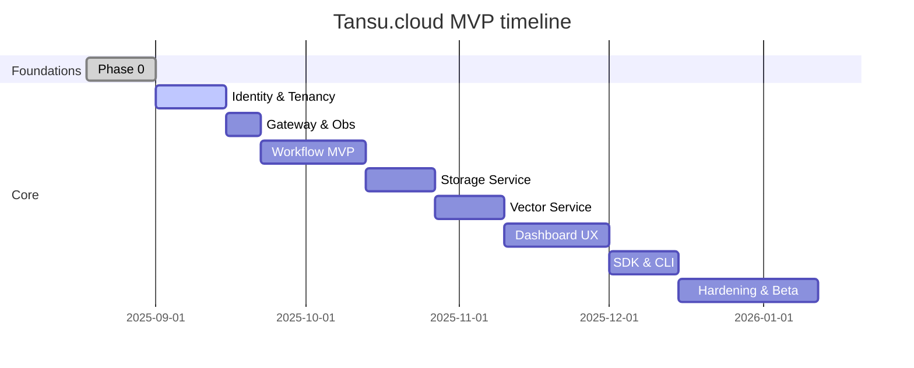

---

## docs/implementation-plan.md

# Tansu.cloud — Development and implementation plan

This plan prioritizes foundations, security, and observability, then delivers core value fast. Each phase includes objectives, scope, tasks, deliverables, acceptance, risks, and exit criteria. A Gantt‑style overview sits at the end.

---

## Phase 0 — Foundations and repo

- **Objectives:** Monorepo, build/test/compose, baseline observability, coding standards.
- **Scope:**
  - Repo structure (apps/, libs/, ops/, docs/), solution files, analyzers.
  - Dev/Prod Docker Compose with: Citus (single node), PgBouncer, Redis, RabbitMQ, Qdrant, Prometheus, Grafana.
  - OTEL + Prometheus metrics in a sample service.
- **Tasks:**
  - **Build:** GitHub Actions (build, test, lint, Docker).
  - **Compose:** Add PgBouncer service, Postgres exporter, RabbitMQ exporter.
  - **Docs:** Onboarding + arch diagrams; runbooks skeleton.
- **Deliverables:** `dev.yml`, `prod.yml`, `prometheus.yml`, Grafana provisioning, coding standards.
- **Acceptance:** `docker compose up` → Grafana shows .NET + infra metrics; sample API passes CI.
- **Risks/Mitigations:** Version drift → pin tags; container health → add healthchecks.
- **Exit criteria:** PR template, CODEOWNERS, Dependabot/Renovate enabled.

---

## Phase 1 — Identity and tenancy

- **Objectives:** Secure auth, tenant context end‑to‑end.
- **Scope:** OpenIddict + ASP.NET Identity, tenant resolver (subdomain/header), RBAC (Admin/Dev/Viewer).
- **Tasks:**
  - Token issuance (Auth Code + PKCE, Client Credentials).
  - Gateway JWT validation; `X-Tenant-Id` propagation.
  - EF Core models (auth schema) with indices.
- **Deliverables:** Login flow for Dashboard; `/auth/me` and `/tenants` endpoints.
- **Acceptance:** E2E login; tenant enforced on protected routes; JWT includes `tenant_id`.
- **Risks/Mitigations:** Token lifetime edge cases → refresh token rotation, replay protection.

---

## Phase 2 — Gateway, BFF, and observability

- **Objectives:** Single entrypoint; aggregated UI backend; metrics visible.
- **Scope:** YARP routes; BFF endpoints (`/me`, `/tenants/current`, activity feed); Prometheus exporters wired.
- **Tasks:**
  - Correlation IDs; request logging; rate limiting.
  - Grafana dashboards for API, DB, RabbitMQ.
- **Deliverables:** BFF + SignalR shell; baseline dashboards.
- **Acceptance:** Dashboards show P50/95 latency, error rates; SignalR handshake succeeds through Gateway.
- **Risks/Mitigations:** WebSocket proxying issues → test HTTP/2 & sticky‑free routing.

---

## Phase 3 — Workflow engine MVP

- **Objectives:** Durable, observable workflows.
- **Scope:** MassTransit over RabbitMQ; saga state in Postgres (via PgBouncer); outbox; idempotency.
- **Tasks:**
  - Commands: Start/Cancel; events: Started, StepCompleted, Failed, Completed.
  - Consumers update `workflows.runs`, `run_steps`, `run_logs`.
  - BFF consumes events → SignalR tenant groups.
- **Deliverables:** `/workflows/{id}/start`, `/runs/{runId}`, `/runs/{runId}/logs`.
- **Acceptance:** Sample workflow runs; UI updates in realtime; DLQ empty under normal load.
- **Risks/Mitigations:** Event storms → batching, backpressure, throttled SignalR updates.

---

## Phase 4 — Storage service

- **Objectives:** Efficient, safe, scalable storage with optimization.
- **Scope:** Presigned URLs via MinIO (S3‑compatible), Brotli/WebP, metadata indexing, post‑upload jobs.
- **Tasks:**
  - Integrate MinIO Docker and configure buckets/policies.
  - Endpoints: presign upload/download, list objects, get metadata.
  - Optimization pipeline (streaming, chunked uploads; Brotli compression; image resize/format to WebP/AVIF as feasible).
  - Events: `ObjectUploaded`, `ObjectReady`.
- **Deliverables:** Storage browser in Dashboard; compression/optimization stats.
- **Acceptance:** 1–5 GB uploads succeed; optimizations recorded; access controls enforced by tenant.
- **Risks/Mitigations:**
  - Large file memory use → stream/pipe; resumable uploads.
  - Signed URL misuse → short TTLs, content‑type/size constraints, one‑time tokens.
  - Scalability → document MinIO clustering/gateway options for production.

---

## Phase 5 — Vector service

- **Objectives:** Useful semantic search.
- **Scope:** Collections, embeddings upsert, top‑K search with filters; Qdrant integration.
- **Tasks:**
  - `collections`, `documents` meta in Postgres.
  - Upsert/search APIs; optional hybrid rerank hook (server‑side).
- **Deliverables:** Vector console in Dashboard.
- **Acceptance:** P95 query latency target met; consistent results across runs.
- **Risks/Mitigations:** Payload bloat → keep payload minimal, hydrate from Storage/DB on demand.

---

## Phase 6 — Dashboard UX

- **Objectives:** Cohesive, role‑aware UI.
- **Scope:** MudBlazor layout; modules for Users, Workflows, Storage, Vector, Reports.
- **Tasks:**
  - SignalR live tiles; empty states; loading skeletons.
  - Reports: traffic, latency, error rates, workflow KPIs, storage usage, vector load.
- **Deliverables:** Navigable, responsive dashboard with auth & tenant context.
- **Acceptance:** Core tasks complete without leaving dashboard; Lighthouse perf budget passes.
- **Risks/Mitigations:** Scope creep → feature flags, staged rollout.

---

## Phase 7 — SDKs and CLI

- **Objectives:** First‑class developer experience.
- **Scope:** NuGet SDKs (Auth/Workflow/Storage/Vector); CLI for tenants, keys, workflows.
- **Tasks:**
  - Interfaces mirror HTTP contracts; cancellation tokens; Polly retries.
  - Contract tests against BFF/Gateway.
- **Deliverables:** Packages published; quickstarts; samples repo.
- **Acceptance:** “Hello workflow + upload + search” sample runs in <60 minutes.
- **Risks/Mitigations:** Contract drift → CI contract tests on PRs.

---

## Phase 8 — Hardening and beta

- **Objectives:** Reliability, performance, and safety.
- **Scope:** Load tests, chaos tests, backup/restore, security review.
- **Tasks:**
  - SLOs: availability, latency, DLQ drain time.
  - Alerts: error rate, queue depth, CPU/memory, Postgres wait events.
  - Backups: Postgres base + WAL; Qdrant snapshots; object storage retention.
- **Deliverables:** Runbooks; SLO dashboards; canary env.
- **Acceptance:** Meets SLOs at target load; zero tenant bleed; restore drill passes.
- **Risks/Mitigations:** Hidden hotspots → index tuning, pool sizing, caching.

---

## Phase 9 — Citus upgrade path (ongoing / as needed)

- **Objectives:** Seamless path from single‑node to multi‑node Citus.
- **Scope:** Add workers; distribute tables by `tenant_id`; rebalance shards.
- **Tasks:**
  - Table classification: reference vs distributed.
  - Shard/placement strategy; rebalance plan; maintenance windows.
- **Deliverables:** Upgrade runbook; smoke tests; pgbouncer unaffected by topology.
- **Acceptance:** App stable pre/post upgrade; query plans healthy; pool sizing revisited.

---

## Cross‑cutting: connection pooling & EF Core

- **EF Core (Npgsql):**
  - **Disable prepared statements**: `Max Auto Prepare=0` when using PgBouncer transaction pooling.
  - **Pooling on**: `Pooling=true; Maximum Pool Size=XX` tuned per service.
  - **Multiplexing**: On for light queries; validate with PgBouncer mode.
- **PgBouncer:**
  - One DSN per database; consider separate pools per high‑traffic service.
  - Monitor with pgbouncer stats; alerts on pool saturation.
- **Acceptance:** No “too many connections” incidents; stable P95 latencies under burst.

---

## Mermaid timeline (high‑level)

## Exit checklist for MVP

- Security: OpenIddict, RBAC, audit logs, secrets rotation.
- Reliability: Outbox, retries, idempotency, DLQ handling, tested restore.
- Performance: P95/P99 budgets met; pool saturation < 80%; no “max connections” events.
- Observability: Golden signals, actionable alerts, runbooks.
- UX/DX: Dashboard modules live; SDK/CLI quickstarts; sample apps working.