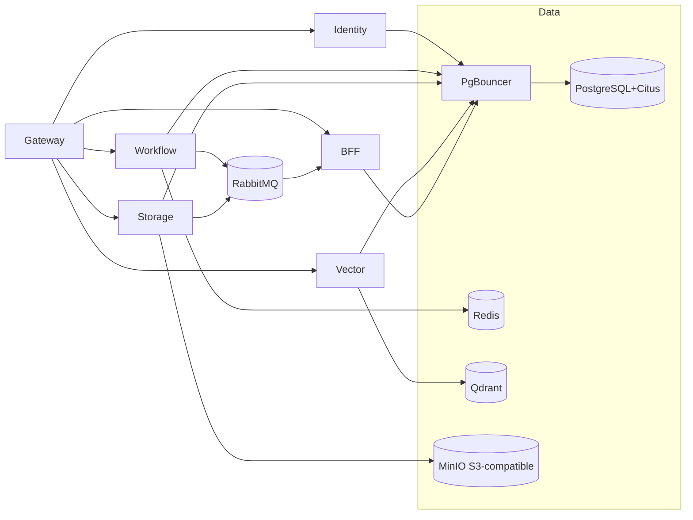
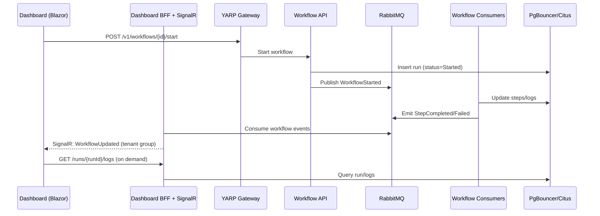

# Tansu.cloud — Developer onboarding

Welcome! Tansu.cloud is a .NET‑native, multi‑tenant backend with workflows, storage, vector search, and a Blazor dashboard. This guide gives you the core concepts, services, responsibilities, data flow, connection pooling, and how to get productive.

---

## 1. Concept and principles

- **Vision:** Supabase‑style backend for .NET — multi‑tenant, orchestrated, observable, extensible.
- **Principles:** Clear boundaries, strong defaults, upgrade paths, developer experience first.
- **Tenancy:** Every call is tenant‑scoped; context flows through gateway, services, bus, and data.

---

## 2. Architecture overview

```mermaid
flowchart TB
  subgraph Client["Clients & SDKs"]
    SDK[NuGet SDKs]
    Blazor[Blazor Admin Dashboard]
  end

  Gateway[YARP API Gateway\nTLS, JWT, tenant routing]
  SDK -->|HTTP/JSON| Gateway
  Blazor -->|HTTP/JSON| Gateway

  subgraph Services["Domain services"]
    Identity[Identity (OpenIddict)\nAuthN/Z, RBAC]
    Workflow[Workflow (MassTransit)\nSagas, events]
    Storage[Storage (.NET)\nPresigned (via MinIO), Brotli/WebP, image ops]
    Vector[Vector API\nQdrant integration]
    BFF[Dashboard BFF + SignalR]
  end

  Gateway --> Identity
  Gateway --> Workflow
  Gateway --> Storage
  Gateway --> Vector
  Gateway --> BFF

  subgraph Bus["Event bus"]
    RMQ[RabbitMQ]
  end
  Workflow <--> |Commands/Events| RMQ
  Storage -->|Post-upload event| RMQ
  RMQ --> BFF

  subgraph Data["Persistence & infra"]
    Citus[(PostgreSQL + Citus)]
    PgB[PgBouncer\n(transaction pooling)]
    Redis[(Redis)]
    Qdrant[(Qdrant)]
    MinIO[(MinIO S3-compatible)]
    Prom[Prometheus]
    Graf[Grafana]
  end

  %% Pooling path
  Services -->|Npgsql| PgB --> Citus
  Identity --> PgB
  Workflow --> PgB
  Storage --> PgB
  Vector --> PgB
  BFF --> PgB

  Workflow --> Redis
  Storage --> MinIO
  Vector --> Qdrant

  Prom --> Gateway
  Prom --> Identity
  Prom --> Workflow
  Prom --> Storage
  Prom --> Vector
  Prom --> RMQ
  Graf --> Prom
```

---

## 3. Services and responsibilities
Service	Responsibilities	Data & deps	Interfaces
Gateway	TLS, JWT validation, tenant resolution, rate limiting	—	HTTP
Identity	OpenIddict provider, tokens, users/roles	PostgreSQL (auth schema) via PgBouncer	HTTP/OIDC
Workflow	Run workflows, saga state, events	PostgreSQL (workflows), Redis, RabbitMQ	HTTP + bus
Storage	Presigned URLs (via MinIO), Brotli/WebP, image optimization, metadata	MinIO (S3‑compatible), PostgreSQL (storage)	HTTP
Vector	Collections, embeddings upsert/search	Qdrant, PostgreSQL (vector meta)	HTTP
Dashboard BFF	Aggregation for UI, SignalR hubs	PostgreSQL (read), RMQ (consume)	HTTP/WebSocket
Observability	Metrics/alerts/dashboards	Prometheus + Grafana	HTTP (scrape)

---

## 4. Data stores and connection pooling
Citus/PostgreSQL:

Access pattern: All services connect to the Citus coordinator through PgBouncer.
Pooling mode: Transaction pooling (best for API loads).
Prepared statements: Disable on client when using transaction pooling.
Sharding: Start single‑node; shard by tenant_id for future multi‑node.

Object storage (scalable): MinIO (Docker) as S3‑compatible backend. Presigned URLs are generated by MinIO; the .NET Storage service focuses on Brotli compression, image optimization (e.g., WebP), and metadata enrichment.

Containerization & orchestration:

- All projects/services under the TansuCloud solution are containerized.
- Container orchestrator: Docker Compose (Visual Studio Docker Compose project).
- Use multi‑stage Dockerfiles for lean and safer images:
  - Build stage: restore, build, test, publish.
  - Runtime stage: minimal base (e.g., mcr.microsoft.com/dotnet/aspnet), copy only published output.
  - Benefit: smaller images, reduced attack surface, faster deploys.

Recommended Npgsql connection string:

With PgBouncer (transaction pooling):

```
Host=pgbouncer;Port=6432;Database=tansucloud;Username=app_user;Password=***;
SSL Mode=Disable;Pooling=true;Maximum Pool Size=50;Tcp Keepalive=true;No Reset On Close=true;Multiplexing=true;
Enlist=false;Auto Prepare Min Usages=0;Max Auto Prepare=0
```

Note: Set Max Auto Prepare=0 to avoid prepared statements in transaction pooling.

PgBouncer baseline config (dev):

Ini
```ini
[databases]
tansucloud = host=db port=5432 dbname=tansucloud auth_user=pgbouncer

[pgbouncer]
listen_port = 6432
listen_addr = 0.0.0.0
pool_mode = transaction
max_client_conn = 1000
default_pool_size = 50
min_pool_size = 10
reserve_pool_size = 20
server_reset_query = DISCARD ALL
ignore_startup_parameters = extra_float_digits
auth_type = md5
auth_file = /etc/pgbouncer/userlist.txt
```

txt
```txt
# userlist.txt
"pgbouncer" "md5<hash>"
"app_user" "md5<hash>"
```

DB bootstrap (dev):

SQL
```sql
-- db/init/00-init.sql
CREATE DATABASE tansucloud;

DO $$
BEGIN
  IF NOT EXISTS (SELECT 1 FROM pg_roles WHERE rolname = 'app_user') THEN
    CREATE ROLE app_user LOGIN PASSWORD 'REPLACE_ME_STRONG';
  END IF;
  IF NOT EXISTS (SELECT 1 FROM pg_roles WHERE rolname = 'pgbouncer') THEN
    CREATE ROLE pgbouncer LOGIN PASSWORD 'REPLACE_ME_STRONG';
  END IF;
END $$;

GRANT CONNECT ON DATABASE tansucloud TO app_user;
GRANT USAGE ON SCHEMA public TO app_user;
```

Rule of thumb for pool sizing:

default_pool_size ≈ sum of active EF Core pools across replicas per service instance.

Keep total pools under coordinator max_connections minus system overhead.

---

## 5. Observability stack
Prometheus: Scrapes /metrics from services; scrapes RabbitMQ and Postgres exporters.

Grafana: Pre‑provisioned dashboards for .NET runtime, HTTP latency, DB, RMQ, and workflow KPIs.

Alertmanager: SLO alerts (availability, P95/P99 latency, DLQ depth, error rate) — introduced in Phase 2.

Dev metrics approach (Phase 0): .NET OpenTelemetry metrics with PrometheusExporter exposing `/metrics` (no collector required). Prometheus scrape jobs target: gateway, identity, workflow, storage (as available), plus postgres_exporter and rabbitmq_exporter.

Prometheus scrape example (prometheus/prometheus.yml):

YAML
```yaml
scrape_configs:
  - job_name: 'dotnet-services'
    metrics_path: /metrics
    static_configs:
      - targets: ['gateway:5000','identity:5000','workflow:5000','storage:5000']
  - job_name: 'postgres'
    static_configs:
      - targets: ['postgres_exporter:9187']
  - job_name: 'rabbitmq'
    static_configs:
      - targets: ['rabbitmq_exporter:9419']
```

---

## 6. Security, tenancy, and RBAC
OpenIddict: First‑party OIDC. Flows: Authorization Code + PKCE for Blazor; Client Credentials for service‑to‑service.

Tenant resolution: Gateway extracts tenant from subdomain or header; forwarded as X-Tenant-Id.

RBAC: Role checks per module (Admin/Dev/Viewer) enforced at BFF and service layer.

---

## 7. Local development
Prereqs: Docker, .NET 8/9 SDK, Node 20 (tooling), Make (optional).

Bootstrap (dev):

```
cp .env.example .env.dev
# edit .env.dev and set PGPASSWORD and any other values
docker compose --env-file .env.dev up -d
```

Apply EF migrations (service projects).

Run Gateway + Identity + BFF.

Login with seeded admin; change password.

Dashboards: Grafana at http://localhost:3000 (admin/admin in dev). Verify .NET metrics and exporters are visible.

Health: GET http://localhost:5000/health returns healthy when services are up.

---

## 8. Production run patterns

- Do not commit real secrets. Provide them at runtime using one of these patterns:
  - Preferred: `.env.prod` file on the host with 0400 permissions, owned by the deploy user, and run:
    ```
    docker compose --env-file .env.prod up -d
    ```
  - Alternative: export variables in the shell (avoid inline `-e` so values are not stored in shell history files):
    ```
    export PGPASSWORD=... NPGSQL__PASSWORD=... GF_SECURITY_ADMIN_PASSWORD=...
    docker compose up -d
    unset PGPASSWORD NPGSQL__PASSWORD GF_SECURITY_ADMIN_PASSWORD
    ```
  - File mounts: store secrets in files and source them in an entrypoint script to populate env vars for the app.
- Avoid passing secrets directly on the CLI with `-e` or embedding them in compose files.
- Rotate credentials regularly; restrict file permissions; prefer unique creds per environment.

---

## 9. Live diagrams (rendered)

### 9.1 Service dependency graph

Mermaid


### 9.2 Workflow run to realtime UI (sequence)

Mermaid


### 9.3 Storage upload with post‑processing

Mermaid
```mermaid
sequenceDiagram
  participant UI as Dashboard
  participant BFF as BFF
  participant ST as Storage API
  participant MIN as MinIO (S3)
  participant BUS as RabbitMQ
  participant DB as PgBouncer/Citus

  UI->>BFF: Request presigned upload URL
  BFF->>ST: POST /storage/presign
  ST->>MIN: Generate presigned URL
  ST->>DB: Insert object metadata (Pending)
  ST-->>UI: Presigned URL (MinIO)
  UI->>MIN: PUT object (direct upload)
  ST->>BUS: Publish ObjectUploaded
  ST->>MIN: Optimize/Compress (Brotli/WebP) from object
  ST->>DB: Update metadata (Ready, sizes, formats)
  ST->>BUS: Publish ObjectReady
  BFF->>BUS: Consume events
  BFF-->>UI: SignalR: ObjectReady
