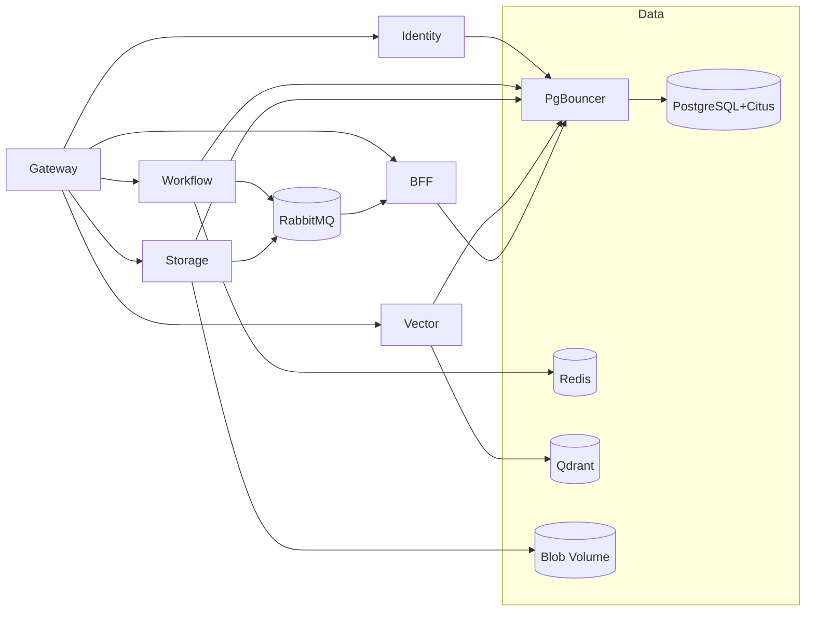
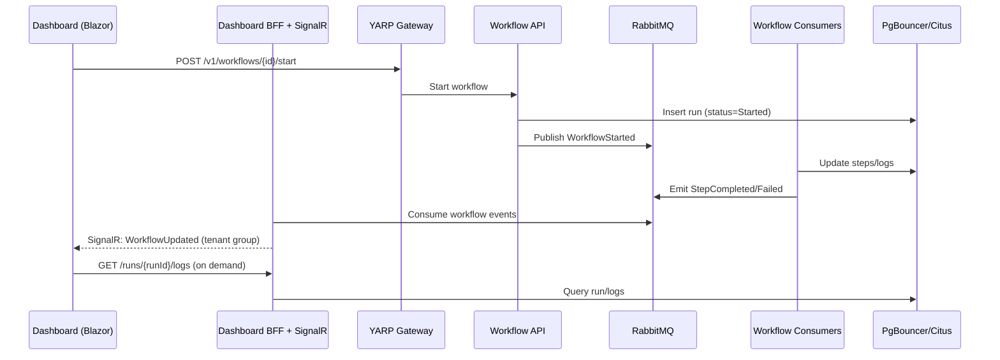
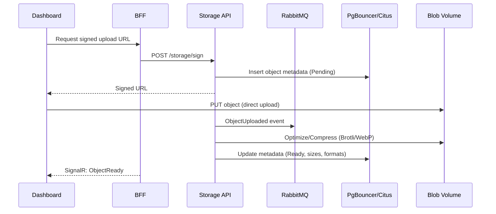

# Tansu.cloud — Developer onboarding

Welcome! Tansu.cloud is a .NET‑native, multi‑tenant backend with workflows, storage, vector search, and a Blazor dashboard. This guide gives you the core concepts, services, responsibilities, data flow, connection pooling, and how to get productive.

---

## 1. Concept and principles

- **Vision:** Supabase‑style backend for .NET — multi‑tenant, orchestrated, observable, extensible.
- **Principles:** Clear boundaries, strong defaults, upgrade paths, developer experience first.
- **Tenancy:** Every call is tenant‑scoped; context flows through gateway, services, bus, and data.

---

## 2. Architecture overview

```mermaid
flowchart TB
  subgraph Client["Clients & SDKs"]
    SDK[NuGet SDKs]
    Blazor[Blazor Admin Dashboard]
  end

  Gateway[YARP API Gateway\nTLS, JWT, tenant routing]
  SDK -->|HTTP/JSON| Gateway
  Blazor -->|HTTP/JSON| Gateway

  subgraph Services["Domain services"]
    Identity[Identity (OpenIddict)\nAuthN/Z, RBAC]
    Workflow[Workflow (MassTransit)\nSagas, events]
    Storage[Storage (.NET)\nSigned URLs, Brotli, image ops]
    Vector[Vector API\nQdrant integration]
    BFF[Dashboard BFF + SignalR]
  end

  Gateway --> Identity
  Gateway --> Workflow
  Gateway --> Storage
  Gateway --> Vector
  Gateway --> BFF

  subgraph Bus["Event bus"]
    RMQ[RabbitMQ]
  end
  Workflow <-->|Commands/Events| RMQ
  Storage -->|Post-upload event| RMQ
  RMQ --> BFF

  subgraph Data["Persistence & infra"]
    Citus[(PostgreSQL + Citus)]
    PgB[PgBouncer\n(transaction pooling)]
    Redis[(Redis)]
    Qdrant[(Qdrant)]
    Blob[(Object storage volume)]
    Prom[Prometheus]
    Graf[Grafana]
  end

  %% Pooling path
  Services -->|Npgsql| PgB --> Citus
  Identity --> PgB
  Workflow --> PgB
  Storage --> PgB
  Vector --> PgB
  BFF --> PgB

  Workflow --> Redis
  Storage --> Blob
  Vector --> Qdrant

  Prom --> Gateway
  Prom --> Identity
  Prom --> Workflow
  Prom --> Storage
  Prom --> Vector
  Prom --> RMQ
  Graf --> Prom
```

---

## 3. Services and responsibilities
Service	Responsibilities	Data & deps	Interfaces
Gateway	TLS, JWT validation, tenant resolution, rate limiting	—	HTTP
Identity	OpenIddict provider, tokens, users/roles	PostgreSQL (auth schema) via PgBouncer	HTTP/OIDC
Workflow	Run workflows, saga state, events	PostgreSQL (workflows), Redis, RabbitMQ	HTTP + bus
Storage	Signed URLs, Brotli/WebP, metadata	Blob volume, PostgreSQL (storage)	HTTP
Vector	Collections, embeddings upsert/search	Qdrant, PostgreSQL (vector meta)	HTTP
Dashboard BFF	Aggregation for UI, SignalR hubs	PostgreSQL (read), RMQ (consume)	HTTP/WebSocket
Observability	Metrics/alerts/dashboards	Prometheus + Grafana	HTTP (scrape)

---

## 4. Data stores and connection pooling
Citus/PostgreSQL:

Access pattern: All services connect to the Citus coordinator through PgBouncer.
Pooling mode: Transaction pooling (best for API loads).
Prepared statements: Disable on client when using transaction pooling.
Sharding: Start single‑node; shard by tenant_id for future multi‑node.

Recommended Npgsql connection string:

Without PgBouncer:

```
Host=pgbouncer;Port=6432;Database=tansu;Username=app_user;Password=***;
SSL Mode=Disable;Pooling=true;Maximum Pool Size=50;Tcp Keepalive=true;No Reset On Close=true;Multiplexing=true;
Enlist=false;Auto Prepare Min Usages=0;Max Auto Prepare=0
```

Note: Set Max Auto Prepare=0 to avoid prepared statements in transaction pooling.

PgBouncer baseline config (dev):

Ini
```ini
[databases]
tansu = host=citus port=5432 dbname=tansu auth_user=pgbouncer

[pgbouncer]
listen_port = 6432
listen_addr = 0.0.0.0
pool_mode = transaction
max_client_conn = 1000
default_pool_size = 50
min_pool_size = 10
reserve_pool_size = 20
server_reset_query = DISCARD ALL
ignore_startup_parameters = extra_float_digits
auth_type = md5
auth_file = /etc/pgbouncer/userlist.txt
```

txt
```txt
# userlist.txt
"pgbouncer" "md5<hash>"
"app_user" "md5<hash>"
```

Rule of thumb for pool sizing:

default_pool_size ≈ sum of active EF Core pools across replicas per service instance.

Keep total pools under coordinator max_connections minus system overhead.

---

## 5. Observability stack
Prometheus: Scrapes /metrics from services; scrapes RabbitMQ and Postgres exporters.

Grafana: Pre‑provisioned dashboards for .NET runtime, HTTP latency, DB, RMQ, and workflow KPIs.

Alertmanager: SLO alerts (availability, P95/P99 latency, DLQ depth, error rate).

---

## 6. Security, tenancy, and RBAC
OpenIddict: First‑party OIDC. Flows: Authorization Code + PKCE for Blazor; Client Credentials for service‑to‑service.

Tenant resolution: Gateway extracts tenant from subdomain or header; forwarded as X-Tenant-Id.

RBAC: Role checks per module (Admin/Dev/Viewer) enforced at BFF and service layer.

---

## 7. Local development
Prereqs: Docker, .NET 8/9 SDK, Node 20 (tooling), Make (optional).

Bootstrap:

```
docker compose -f ops/compose/dev.yml up -d
```

Apply EF migrations (service projects).

Run Gateway + Identity + BFF.

Login with seeded admin; change password.

Dashboards: Grafana at http://localhost:3000 (admin/admin in dev).


## 8. Live diagrams (rendered)

### 8.1 Service dependency graph

Mermaid


### 8.2 Workflow run to realtime UI (sequence)

Mermaid


### 8.3 Storage upload with post‑processing

Mermaid



version: "3.9"

name: tansucloud-dev

services:
  gateway:
    build: ../src/Gateway
    ports:
      - "5000:5000"
    depends_on:
      - identity
    environment:
      - ASPNETCORE_ENVIRONMENT=Development
    networks: [tansucloud]

  identity:
    build: ../src/Identity
    environment:
      - ASPNETCORE_ENVIRONMENT=Development
    depends_on:
      - db
    networks: [tansucloud]

  workflow:
    build: ../src/Workflow
    environment:
      - ASPNETCORE_ENVIRONMENT=Development
    depends_on:
      - db
      - rabbitmq
    networks: [tansucloud]

  storage:
    build: ../src/Storage
    environment:
      - ASPNETCORE_ENVIRONMENT=Development
    depends_on:
      - db
    networks: [tansucloud]

  vector:
    image: qdrant/qdrant:v1.13.4
    volumes:
      - ./qdrant_data:/qdrant/storage
    ports:
      - "6333:6333"
    networks: [tansucloud]

  db:
    image: citusdata/citus:12.1
    environment:
      - POSTGRES_PASSWORD=postgres
    ports:
      - "5432:5432"
    volumes:
      - ./pg_data:/var/lib/postgresql/data
    networks: [tansucloud]

  redis:
    image: redis:7
    ports:
      - "6379:6379"
    networks: [tansucloud]

  rabbitmq:
    image: rabbitmq:3.13-management
    ports:
      - "5672:5672"
      - "15672:15672"
    networks: [tansucloud]

  prometheus:
    image: prom/prometheus:v2.53.0
    volumes:
      - ./prometheus.yml:/etc/prometheus/prometheus.yml
    ports:
      - "9090:9090"
    networks: [tansucloud]

  grafana:
    image: grafana/grafana:11.1.0
    ports:
      - "3000:3000"
    depends_on:
      - prometheus
    networks: [tansucloud]

  pgbouncer:
    image: edoburu/pgbouncer:1.22.0
    ports:
      - "6432:6432"
    environment:
      - DB_HOST=db
      - DB_PORT=5432
    volumes:
      - ./pgbouncer/pgbouncer.ini:/etc/pgbouncer/pgbouncer.ini:ro
      - ./pgbouncer/userlist.txt:/etc/pgbouncer/userlist.txt:ro
    depends_on: [db]
    networks: [tansucloud]

  postgres_exporter:
    image: prometheuscommunity/postgres-exporter
    environment:
      - DATA_SOURCE_URI=pgbouncer:6432/tansucloud?sslmode=disable
      - DATA_SOURCE_USER=app_user
      - DATA_SOURCE_PASS=postgres
    networks: [tansucloud]

  rabbitmq_exporter:
    image: kbudde/rabbitmq-exporter
    environment:
      - RABBIT_URL=http://rabbitmq:15672
      - RABBIT_USER=guest
      - RABBIT_PASSWORD=guest
    networks: [tansucloud]

networks:
  tansucloud:
    driver: bridge


version: "3.9"

name: tansucloud-prod

services:
  gateway:
    image: ghcr.io/tansucloud/gateway:latest
    restart: always
    environment:
      - ASPNETCORE_ENVIRONMENT=Production
    depends_on:
      - identity
    networks: [tansucloud]

  identity:
    image: ghcr.io/tansucloud/identity:latest
    restart: always
    environment:
      - ASPNETCORE_ENVIRONMENT=Production
    depends_on:
      - db
    networks: [tansucloud]

  workflow:
    image: ghcr.io/tansucloud/workflow:latest
    restart: always
    environment:
      - ASPNETCORE_ENVIRONMENT=Production
    depends_on:
      - db
      - rabbitmq
    networks: [tansucloud]

  storage:
    image: ghcr.io/tansucloud/storage:latest
    restart: always
    environment:
      - ASPNETCORE_ENVIRONMENT=Production
    depends_on:
      - db
    networks: [tansucloud]

  vector:
    image: qdrant/qdrant:v1.13.4
    restart: always
    volumes:
      - ./qdrant_data:/qdrant/storage
    networks: [tansucloud]

  db:
    image: citusdata/citus:12.1
    restart: always
    environment:
      - POSTGRES_PASSWORD_FILE=/run/secrets/db_password
    volumes:
      - pg_data:/var/lib/postgresql/data
    networks: [tansucloud]
    secrets:
      - db_password

  redis:
    image: redis:7
    restart: always
    networks: [tansucloud]

  rabbitmq:
    image: rabbitmq:3.13-management
    restart: always
    ports:
      - "15672:15672"
    networks: [tansucloud]

  prometheus:
    image: prom/prometheus:v2.53.0
    restart: always
    volumes:
      - ./prometheus.yml:/etc/prometheus/prometheus.yml:ro
    networks: [tansucloud]

  grafana:
    image: grafana/grafana:11.1.0
    restart: always
    environment:
      - GF_SECURITY_ADMIN_PASSWORD__FILE=/run/secrets/grafana_admin_password
    depends_on:
      - prometheus
    networks: [tansucloud]
    secrets:
      - grafana_admin_password

  pgbouncer:
    image: edoburu/pgbouncer:1.22.0
    ports:
      - "6432:6432"
    environment:
      - DB_HOST=db
      - DB_PORT=5432
    volumes:
      - ./pgbouncer/pgbouncer.ini:/etc/pgbouncer/pgbouncer.ini:ro
      - ./pgbouncer/userlist.txt:/etc/pgbouncer/userlist.txt:ro
    depends_on: [db]
    networks: [tansucloud]

  postgres_exporter:
    image: prometheuscommunity/postgres-exporter
    environment:
      - DATA_SOURCE_URI=pgbouncer:6432/tansucloud?sslmode=disable
      - DATA_SOURCE_USER=app_user
      - DATA_SOURCE_PASS=postgres
    networks: [tansucloud]

  rabbitmq_exporter:
    image: kbudde/rabbitmq-exporter
    environment:
      - RABBIT_URL=http://rabbitmq:15672
      - RABBIT_USER=guest
      - RABBIT_PASSWORD=guest
    networks: [tansucloud]

volumes:
  pg_data:

secrets:
  db_password:
    file: ./secrets/db_password.txt
  grafana_admin_password:
    file: ./secrets/grafana_admin_password.txt

networks:
  tansucloud:
    driver: bridge
